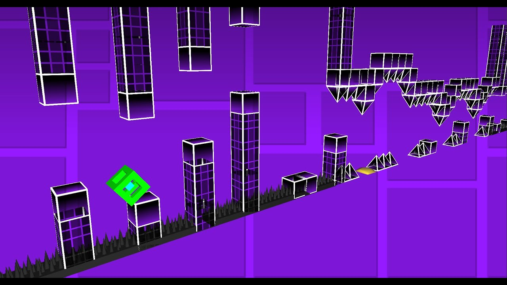
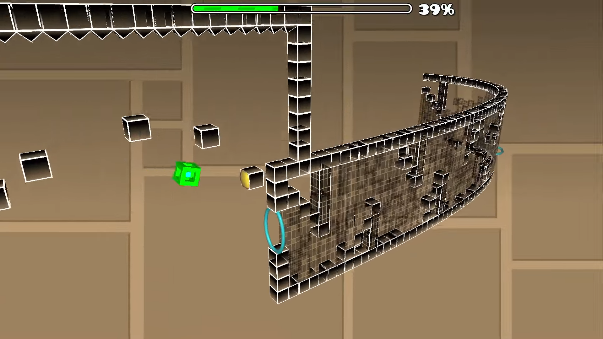
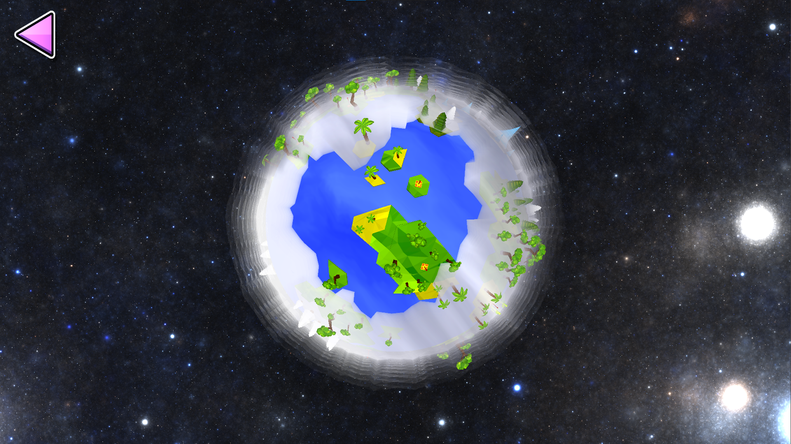
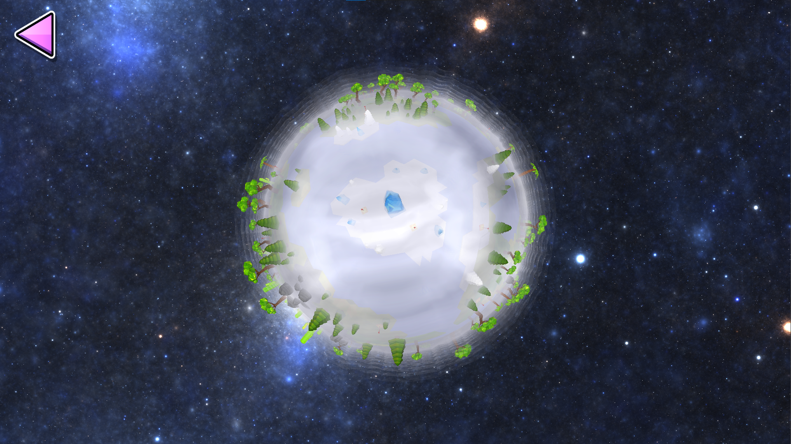

# Geome3Dash

**Geome3Dash** transforms the 2D Geometry Dash you know and love into an exciting, open-source 3D experience. Jump into a new dimension of gameplay, customize levels like never before, and explore the adventure of a lifetime.  

---

## Key Features  

### Experience Geometry Dash in 3D  
Every Geometry Dash level gets a fresh perspective as it’s automatically converted into 3D. Classic gameplay meets immersive visuals for an unforgettable experience.  

### Level Customization  
Bring your creativity to life with advanced editing tools:  
- **3D Level Path**: Adjust the level's 3D trajectory with the **Path button**, conveniently located near the Level Settings button.  
- **Camera Angles**: Modify the viewing experience by selecting the **Cam button**, giving you full control over how the 3D camera function.  

### Story Mode Adventure  
Dive into an all-new **Story Mode**:  
- Access it via the **Globe button** in the Creator menu.  
- Explore a rotating 3D world map featuring interactive level markers.  
- Complete 20 levels, with each one unlocking the next stage in your epic journey.  

---

## Contribute to the Geome3Dash Project

**Contribute to the Project:**  
- **Code Contributions**: Submit bug fixes, new features, or enhancements. Simply fork the repository, make your changes, and submit a pull request. Follow the guidelines and include clear documentation for a smoother review process.  
- **3D Models**: Share your artistic talents by creating and submitting custom 3D models for objects or game modes.  

Start by visiting the [GitHub repository](https://github.com/adafcaefc/Geome3Dash/).  

**Join the Conversation:**  
Have suggestions or need help? Connect with developers and fans on our [Discord server](https://discord.gg/CAVBVgMnSD).  

---

## Screenshots

---

## Credits  

### Core Development Team  
- **[RainixGD](https://www.youtube.com/@rainixgd)**  
- **[Adaf](https://www.youtube.com/@adaf3003)**  

### Soundtrack Producer
- **[A145](https://www.youtube.com/@A145)**  

### Special Thanks  
- **[Weebify](https://www.youtube.com/channel/UCAE-cJ-exfnSlq0Ddkd985g)** – Help on Geode usage  
- **[A145](https://www.youtube.com/@A145)** – Beta testing and ongoing support  
- **[Lexi](https://github.com/KontrollFreek)** - Beta testing

---

## Tools, Libraries, and Assets  

Geome3Dash utilizes a range of open-source tools and assets:  

- **[Khalfanel](https://sketchfab.com/Khalfan_el)** ([License](https://creativecommons.org/licenses/by/4.0/))  
- **[Cartoon Guy](https://sketchfab.com/1003224735)** ([License](https://creativecommons.org/licenses/by/4.0/))  
- **[Geode](https://github.com/orgs/geode-sdk/people)** ([License](https://github.com/geode-sdk/geode/blob/main/LICENSE.txt))  
- **[gd-imgui-cocos](https://github.com/matcool/gd-imgui-cocos/tree/geode)** ([License](https://github.com/matcool/gd-imgui-cocos/blob/geode/LICENSE))  
- **[tinyfiledialogs](https://sourceforge.net/projects/tinyfiledialogs)** ([License](https://sourceforge.net/projects/tinyfiledialogs/files/README.txt/download))  
- **[assimp](https://github.com/assimp/assimp)** ([License](https://github.com/assimp/assimp/blob/master/LICENSE))  
